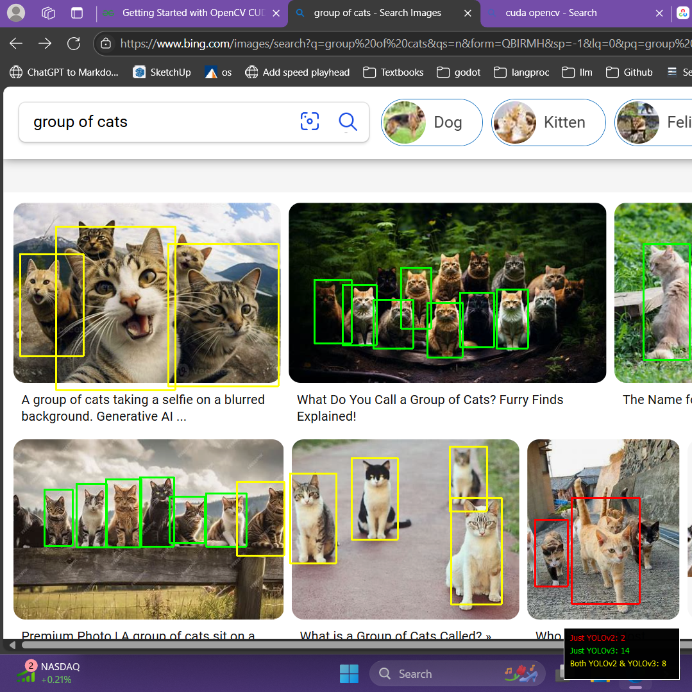

# YOLO Detection Comparison

This project compares object detection results between YOLOv2 and YOLOv3 models. It overlays detection results on the screen and provides a legend with counts for each model's detections.


## Features
- Detects objects using YOLOv2 and YOLOv3.
- Displays bounding boxes and a legend with detection counts.
- Highlights matched detections between the two models.

## Requirements
- Python 3.x
- OpenCV
- PyQt5
- mss
- pyautogui
- keyboard

## Installation

1. Install the required Python packages:
   ```bash
   pip install -r requirements.txt
   ```

2. Place the YOLO configuration (`.cfg`) and weights (`.weights`) files in the project directory.

## Usage
1. Run `cat_detector_overlay.py`.
2. Press `F8` to capture the screen and display detection results.

## Notes
- Ensure the YOLOv2 and YOLOv3 configuration and weights files are correctly named and located in the project directory.
- Adjust the `CONFIDENCE_THRESHOLD` in the script as needed.